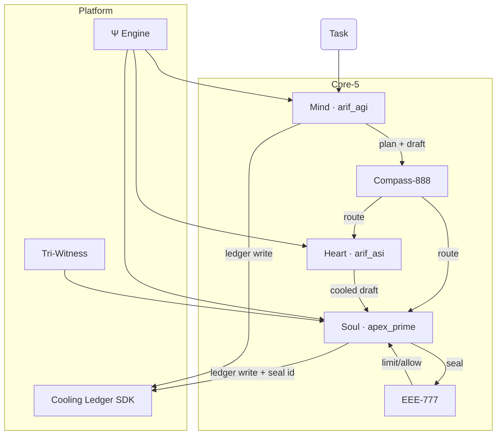

# ArifOS Codex Architecture

ArifOS Codex coordinates a federation of specialised agents that transform a task request into a governed, sealed response. The
system is organised around three layers:

1. **Platform services** provide shared guarantees such as the Cooling Ledger, Ψ metrics, and Tri-Witness quorum checks.
2. **Core-5 organs** (Mind, Heart, Soul, Compass, Equilibrium) orchestrate reasoning, tone, adjudication, routing, and rate
   limiting.
3. **Integration runloop** binds the Core-5 into a deterministic pipeline that enforces TEARFRAME floors, idempotent ledgering,
   and refusal-first safeguards.

## Component map

* **Mind (arif_agi)** generates a structured plan and draft. It records an idempotent ledger entry tagged with `plan_id`,
  `route_history`, and `seed_provenance` so that repeat attempts replay safely.
* **Compass-888** evaluates the draft metrics to decide whether to revisit the Mind, invoke Heart cooling, or proceed to Soul.
* **Heart (arif_asi)** applies tone adjustments and recomputes metrics when Peace² or κᵣ slip below floors.
* **Soul (apex_prime)** enforces refusal-first policy. It only seals drafts that satisfy all floors and Tri-Witness quorum,
  writing the second side of the double-entry ledger.
* **EEE-777** stabilises the flow by delaying or blocking near-threshold drafts and by orchestrating SABAR cooling.

## Cooling Ledger lifecycle

1. **Draft produced** – the Mind module issues a ledger entry with sanitised notes and metadata.
2. **Route provenance** – the integration runloop appends route history and seed hashes to the idempotency key, preventing
   accidental duplicates.
3. **Refusal or Seal** – if the limiter blocks the flow, the runloop returns a `delay` status without touching the ledger again;
   otherwise Apex Prime seals and records a matching entry.
4. **Replay guard** – the ledger rejects repeats of the same `(plan_id, hash)` pair, ensuring Phoenix-72 audits reflect true
   historical events.

## Schema guarantees

The `RunloopResult` dataclass in `packages/integration/runloop.py` validates that every orchestration outcome contains:

- `status` ∈ {`sealed`, `delay`}
- `plan_id` with a matching `plan.plan_id`
- `seeded` flag and optional `seed_hash`
- `route_history` for provenance and idempotency
- `seal_id` present only for sealed runs

Because the result is schema-checked, downstream tooling (dashboards, Phoenix-72 jobs, federation adapters) can trust the
payload without defensive parsing.

## Extensibility seams

- **Federation adapters**: new agents (@WELL, @RIF, @WEALTH, @PROMPT, @GEOX) can call `runloop()` and attach their own metadata
  while inheriting the same floors and ledger rules.
- **Telemetry dashboard**: the append-only JSONL ledger enables offline analysis – a Phase 3 task will convert entries into
  Ψ/ΔS/Peace² timelines.
- **Constitutional wrapper**: sealing hooks can export signed receipts to external auditors without bypassing the in-repo ledger.

These seams let ArifOS expand while maintaining governed behaviour and auditable history.
